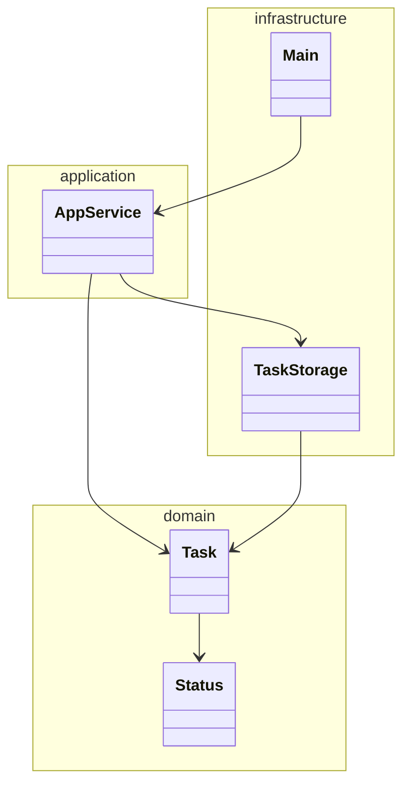
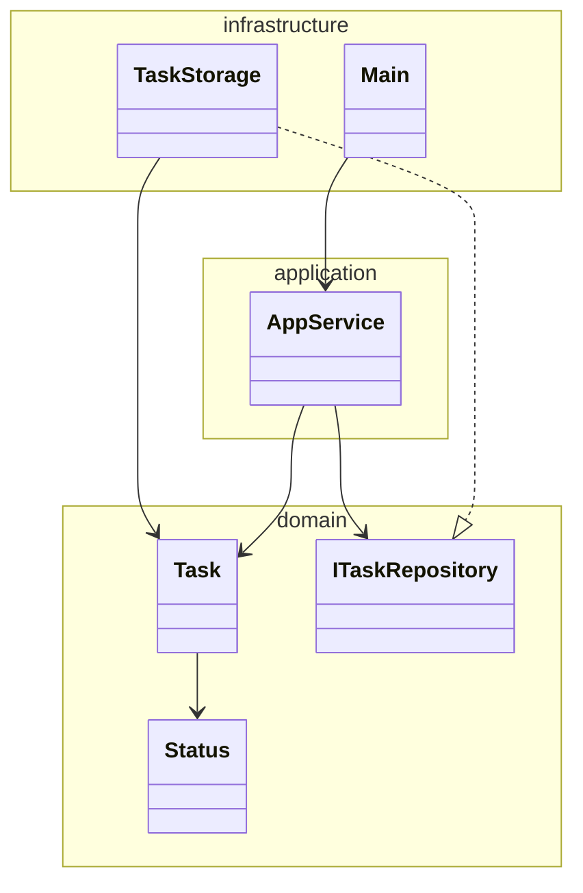

# 依存性逆転の法則とは？

Wikipedia から引用してみる。
> 依存性逆転の原則または依存関係逆転の原則（dependency inversion principle）とは、オブジェクト指向設計の用語であり、ソフトウェアモジュールの疎結合を確立する特別な形態を表現したコンセプトである。SOLIDの五原則の一つとして知られる。

うん……うん？もうちょっと読む
> オブジェクト指向における従来の依存関係とは、上位モジュールから下位モジュールへの方向性であり、仕様定義を担う上位モジュールを、詳細実装を担う下位モジュールから独立させて、各下位モジュールを別個保存するというものだったが、それに対して依存性逆転原則は以下二点を提唱している。
> 
> 1. 上位モジュールはいかなるものも下位モジュールから持ち込んではならない。双方とも抽象（例としてインターフェース）に依存するべきである。
> 2. 抽象は詳細に依存してはならない。詳細（具象的な実装内容）が抽象に依存するべきである。

まあ、はい、という感じで、結構難しい。一応実装レベルというか、具体例を出しながら説明もされているので、詳しくは引用元を参照されたい。  
https://ja.wikipedia.org/wiki/%E4%BE%9D%E5%AD%98%E6%80%A7%E9%80%86%E8%BB%A2%E3%81%AE%E5%8E%9F%E5%89%87

再発明っぽい感じにはなるが、ここでは実際に動くソースコードを例にして refactoring しながら議論を進めていく、という形をとることで差別化を図りたい。また、ここで見るソースコードは DDD（ドメイン駆動設計）を基調としている点も異なる点だ。

# Clean Architecture と MVC

まず、Clean Architecture において、理想的な依存関係を確認する。

https://blog.cleancoder.com/uncle-bob/2012/08/13/the-clean-architecture.html

これを見た時点で、伝統的な MVC アーキテクチャに慣れてる人は戸惑うと思う。MVC では、Model 内に DB との通信処理が記述される。

一方で、前掲のクリーンアーキテクチャの同心円の図を見ると、DB との通信は一番外側の円にある。そんなことできるの？

# naive に、MVC ぽく考えてみる

まず、`master` branch における依存関係をクラス図にしてみる。

うーん、どこが変なのかなぁ★

直観的に、infrastructure と application が相互依存になっている点が臭う。そして実際、Clean Architecture 上、application 層は infrastructure 層に依存すべきでない。

依存の方向ということだけで考えるならば、`TaskStorage` を domain 層に移してしまえばそれで終わりではある。が、DDD において domain 層では具体的な技術に依存することはしてはいけない。変更容易性が落ちるからだ。比較的安定である業務領域を司る domain 層と具体的な使用技術とが密結合になっていると、仮に別の技術を使いたいとなったとき、その部分だけ付け替えるということができなくなるからだ。

では、どうするか。

# まず DI してみる

`AppService` が field に `TaskStorage` を直接持っており、インスタンス化も `AppService` 内でやっている。これは確かに依存度が高そうだ。

依存する部品を直接持たないようにするにはどうしたらよいだろうか？これは調べると DI（依存性の注入） が出てくる。なるほど。やってみよう。

[`di` branch](https://github.com/cyan515/dependency-inversion-principle-sample/pull/2/files)

……変わって無くない？うん、まあこの時点ではそんなに変わらない。クラス図も前掲のものと変わらず、やはり application 層が infrastructure 層に依存している。
強いて言えば、`AppService` の単体テストがやりやすくなる。DI する前は強制的に `TaskStorage` を使わされていたが、DI 後のソースコードではコンストラクタで `TaskStorage` を継承した任意のクラスを注入することができるようになった。
`TaskStorage` の差し替えをする際に、reflection して mock するとか、mock library を使うとか、そういうことをしなくてよくなったのだ。

しかし前述の通り依存の方向はこのままではマズい。これだけでは足りないということだ。文字通り「依存関係を逆転」させることができれば解決するのだが……。

# じゃあ、DIP してみる

今回はタスク管理アプリのようなものを例として考えている。このアプリの業務領域において、ユーザーが入力したものを保存しておく、という要求は普遍的なものだろう。
入力したらその内容はあとはどうでもよくて、後から確認することも更新することも全くない、なんてことはありえなさそう。というかアプリ一般においてそんな状況って存在するのか？入力した文章とか自体がどうでもいいというのはタイピングゲームぐらい？

というわけで、保存する、という処理自体は domain 層に入れてしまってよさそう。ただし、注意しなければならないのは domain に具体的な使用技術を持ち込んではいけない。どうするか。

「保存する」という振る舞いを定義しつつ、その中身は定義しない、これは Java では `interface` がうってつけだ。これを使う。

[`dip` branch](https://github.com/cyan515/dependency-inversion-principle-sample/pull/3/files)

クラス図を改めて書いてみる。

こうすることで、具体的にどのように保存するかはさておき、domain 層を構築することができた。
今は揮発する heap 上にデータを保存しているが、不揮発なストレージに永続化することになったとしても、domain 層に手は入らない。
infrastructure 層でその repository を実装して、上の層から DI すればよいだけである。

# ありそうな疑問点

## MVC がダメってこと？

そこまで言ってなくて、細かい依存関係とか考えずにサクっと作るだけ作っちゃった方が良い場合も多々ある。使用技術を変えたくなることなんかないという場合や、アプリケーションの規模が小さくて単体テスト容易性とかどうでもいい場合など。

## `AppService` は上の層から受け取った引数の中身を利用してるんだから、まだ上の層に依存してるって言えない？

まあそう考えることもできそうだが、少なくともソフトウェア工学において、というか、OOP の文脈においてそれを「依存している」とは呼ばない。
確かに上位層から受け取った instance がバグってると下の層もバグる。例えば、`readOne` が実はデータを読みだした後にそのデータを削除する、みたいな実装になっていると、とんでもないことになる。
でもこれは、`application` 層以下は特に心配しなくてよい。

最後にこの点について LSP（リスコフの置換原則）についてちょっとだけ話しておく。

# LSP

LSP は簡単に言うと、「継承を使うなら、子の振る舞いは親と同じような感じにしてね、急に全然違うことやらないでね」だ。
もうちょっと難しく言うと「親ができていたことを子ができなくなっちゃダメだし、親で hogehoge という風に動作すると定義されてるなら子の実装はそれに従ってなきゃいけない」という感じ。

例えば先述の例だと、`readOne` という method は命名から明らかなように、CRUD 処理のうち Read のみを行うものだ。それを無視して急に Delete までやりだしたら、それはおかしいよね、という話になる。単一責任の原則にも違反してそう。

（実際に規模の大きい開発をするときは、実は「命名から明らか」は逃げ口上でしかなく、本当のことを言うと javadoc で `@implspec` を明記すべき。例えば上記 `readOne` だったら副作用起こしちゃダメだぞ、とかを書く。）

ということで、そういう変な振る舞いをする instance を注入されたら確かにバグるが、それはバグのある `implements` をした上位層の責任であるので、下位層はそれを気にしない。

逆に言うと、LSP をちゃんと守って開発してないと、とんでもないバグが埋め込まれる（可能性がある）、とも言える。
